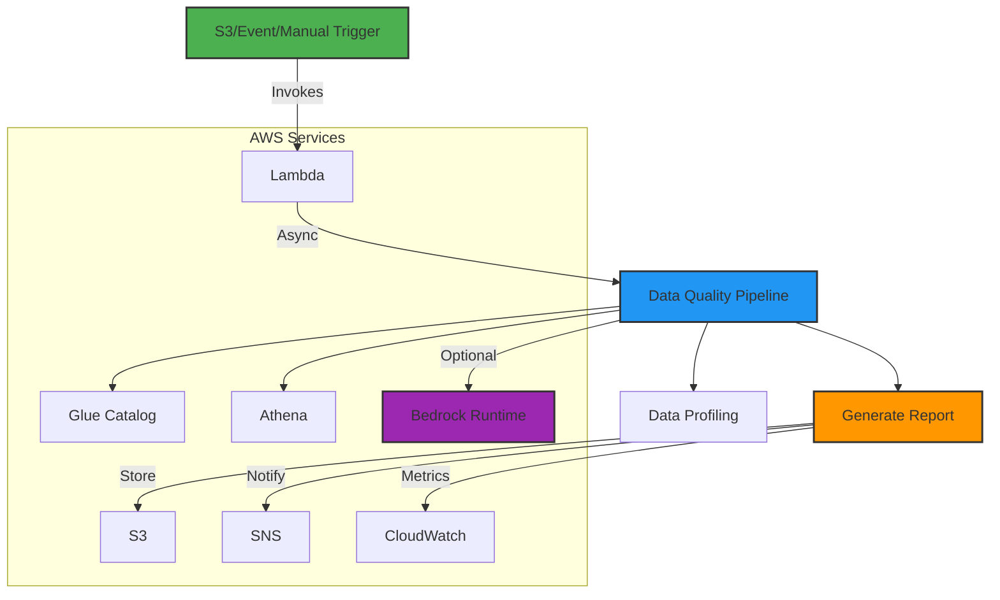

# AWS Data Quality Bots with Amazon Bedrock

A production-ready, AI-powered solution for autonomous data quality monitoring, analysis, and remediation in AWS data lakes. This solution leverages Amazon Bedrock's Titan foundation models to provide intelligent insights and recommendations for data quality issues in real-time.

> **New**: Now with enhanced AI-powered analysis and async processing for improved performance and reliability!

## 🚀 Features

- **AI-Powered Analysis**: Leverages Amazon Titan models through Bedrock for intelligent data quality insights and recommendations
- **Automated Data Quality Checks**: Implements comprehensive validation rules for data quality
- **Flexible Data Sources**: Works with various data formats in S3
- **Detailed Reporting**: Generates comprehensive data quality reports
- **Serverless Architecture**: Built on AWS Lambda (with async processing), Glue, and EventBridge
- **Efficient Dependencies**: Utilizes AWS-managed AWSSDKPandas-Python39 layer for reliable dependency management
- **Easy Deployment**: Simple setup with Terraform or manual AWS console configuration
- **Extensible Design**: Easy to add custom validation rules and data sources

## 🏗️ Architecture



## 🆕 What's New

- **Async Lambda Handler**: Improved performance with async/await pattern
- **Amazon Titan Integration**: Enhanced AI analysis using Amazon Titan foundation models
- **Dynamic Report Loading**: Web UI now supports loading reports from S3
- **Enhanced Error Handling**: Better error recovery and reporting
- **Comprehensive Metrics**: Detailed CloudWatch metrics for monitoring

## 🚀 Quick Start

### Prerequisites

- AWS Account with appropriate permissions
- Python 3.9+ and pip
- AWS CLI configured with credentials
- Terraform (for automated deployment)

### Automated Deployment with Terraform

1. Clone the repository:
   ```bash
   git clone https://github.com/your-org/aws-data-quality-bots.git
   cd aws-data-quality-bots
   ```

2. Initialize Terraform:
   ```bash
   terraform init
   ```

3. Review and customize variables in `terraform.tfvars`

4. Deploy the infrastructure:
   ```bash
   terraform apply
   ```

### Manual Deployment

For manual deployment steps, see [MANUAL_STEPS.md](manual_steps.md)

## 🛠️ Enhanced Lambda Architecture

The solution now uses an async/await pattern for improved performance and reliability:

1. **Synchronous Wrapper**
   - Handles Lambda invocation
   - Manages async event loop
   - Provides consistent error handling

2. **Async Core**
   - Non-blocking I/O operations
   - Concurrent execution of checks
   - Better resource utilization

3. **AI Analysis**
   - Optional Amazon Titan model integration
   - Configurable via environment variables
   - Graceful degradation if Bedrock is unavailable

## 📦 Lambda Layer Deployment

This project uses AWS Lambda Layers to manage dependencies. The layer includes all required Python packages, keeping your Lambda deployment package small and efficient.

### Building the Layer

1. Ensure you have Python 3.9+ installed
2. Run the build script:
   ```bash
   python3 scripts/build_layer.py
   ```
3. The layer package will be created at: `build/layer/data-quality-deps.zip`

### Uploading the Layer to AWS

1. Go to AWS Lambda Console → Layers → Create Layer
2. Configure the layer:
   - Name: `data-quality-deps`
   - Upload the ZIP file: `build/layer/data-quality-deps.zip`
   - Select Python 3.9 as the compatible runtime
   - Add Python 3.9 as a compatible architecture (x86_64)
3. Note the ARN of the created layer for use in your Lambda function

### Using the Layer in Your Lambda Function

1. In your Lambda function configuration, go to the "Layers" section
2. Click "Add a layer"
3. Select "Custom layers" and choose the `data-quality-deps` layer
4. Select the latest version and click "Add"

## 🛠 Prerequisites

- AWS Account with appropriate permissions
- Terraform v1.3.0 or later
- AWS CLI v2.x configured with credentials
- Python 3.9+ (for local development and testing)
- Node.js 16+ (for running development tools)
- [pre-commit](https://pre-commit.com/) (for Git hooks)

## 🚀 Quick Start

1. **Clone the repository**
   ```bash
   git clone https://github.com/your-org/aws-data-quality-bots.git
   cd aws-data-quality-bots
   ```

2. **Install development dependencies**
   ```bash
   make init
   ```

3. **Configure your environment**
   ```bash
   cp terraform.tfvars.example terraform.tfvars
   # Edit terraform.tfvars with your configuration
   ```

4. **Initialize and apply Terraform**
   ```bash
   make plan  # Review the changes
   make apply  # Apply the configuration
   ```

## 🏗 Project Structure

```
aws-data-quality-bots/
├── .github/                  # GitHub Actions workflows
│   └── workflows/
│       └── deploy.yml        # CI/CD pipeline
├── lambda_functions/         # Lambda function code
│   └── data_quality_checker/
│       ├── lambda_function.py  # Main Lambda handler
│       ├── requirements.txt    # Python dependencies
│       └── tests/             # Unit tests
├── modules/                  # Reusable Terraform modules
├── .pre-commit-config.yaml   # Pre-commit hooks
├── Makefile                 # Development commands
├── main.tf                  # Main Terraform configuration
├── variables.tf             # Input variables
├── outputs.tf               # Output values
├── providers.tf             # Provider configurations
├── versions.tf              # Version constraints
└── README.md                # This file
```

## 🔧 Configuration

### Environment Variables

| Variable | Description | Default | Required |
|----------|-------------|---------|:--------:|
| `S3_BUCKET` | S3 bucket for storing results | - | ✅ |
| `SNS_TOPIC_ARN` | SNS topic ARN for alerts | - | ❌ |
| `GLUE_DATABASE` | Glue database name | - | ✅ |
| `GLUE_TABLE` | Glue table name | - | ✅ |
| `AWS_REGION` | AWS region for services | us-east-1 | ❌ |
| `LOG_LEVEL` | Logging level (DEBUG, INFO, WARNING, ERROR) | "INFO" | ❌ |
| `BEDROCK_ENABLED` | Enable Bedrock AI analysis | "false" | ❌ |
| `BEDROCK_MODEL_ID` | Amazon Titan model ID | "amazon.titan-text-express-v1" | ❌ |
| `MAX_RETRY_ATTEMPTS` | Max retry attempts for AWS API calls | 3 | ❌ |

### Terraform Variables

Key variables to configure in `terraform.tfvars`:

```hcl
# AWS Configuration
aws_region = "us-east-1"

# Project Configuration
project_name = "data-quality-bots"
environment  = "dev"

# Data Quality Configuration
default_database  = "your_database"
default_table     = "your_table"  # Leave empty to check all tables
enable_ai_analysis = true
log_level         = "INFO"
log_retention_days = 30

# Notification Configuration
notification_emails = ["your-email@example.com"]

# VPC Configuration (if needed)
# vpc_id = "vpc-xxxxxxxx"
# lambda_subnet_ids = ["subnet-xxxxxxxx", "subnet-yyyyyyyy"]
```

## 🚦 Usage

### Running Manually

Invoke the Lambda function with custom parameters:

```bash
aws lambda invoke \
  --function-name data-quality-bots-dev-checker \
  --payload '{
    "database": "your_database", 
    "table": "your_table",
    "enable_ai_analysis": true
  }' \
  output.json
```

### Viewing Results

1. **S3 Reports**:
   ```bash
   # List all quality reports
   aws s3 ls s3://data-quality-bots-dev-123456789012/quality-reports/
   
   # Download a specific report
   aws s3 cp s3://data-quality-bots-dev-123456789012/quality-reports/your_database/your_table/2023/01/01/20230101_120000.md .
   ```

2. **CloudWatch Logs**:
   ```bash
   # View recent logs
   aws logs tail /aws/lambda/data-quality-bots-dev-checker --follow
   
   # Open in CloudWatch Console
   aws console logs tail --follow /aws/lambda/data-quality-bots-dev-checker
   ```

3. **CloudWatch Dashboard**:
   Access the pre-configured dashboard through the AWS Console or via the URL output by Terraform.

## 🤖 Enhanced AI-Powered Analysis

The solution now leverages Amazon Titan foundation models through Bedrock for advanced data quality insights:

### Key Features

1. **Intelligent Data Profiling**
   - Automated schema analysis
   - Statistical distribution detection
   - Pattern recognition in data

2. **Anomaly Detection**
   - Identifies outliers and unusual patterns
   - Detects data drift over time
   - Flags potential data quality issues

3. **Smart Recommendations**
   - Suggests data quality rules
   - Recommends data transformations
   - Provides data cleaning guidance

### Configuration

Enable AI analysis by setting these environment variables:

```bash
BEDROCK_ENABLED=true
BEDROCK_MODEL_ID=amazon.titan-text-express-v1  # or other Titan model
```

### Sample AI Insights

The AI analysis provides human-readable insights such as:
- Data distribution anomalies
- Potential data quality issues
- Schema recommendations
- Data transformation suggestions

### Web Dashboard

Access the interactive web dashboard to view AI insights:

```bash
# After deployment, access the dashboard URL from CloudFormation outputs
open https://your-cloudfront-url.com/?report=reports/your_db/your_table/latest/report.json
```


## 🚀 Getting Started with the Web Dashboard

The solution includes a modern web interface for exploring data quality reports:

### Features

- **Dynamic Report Loading**: Load reports directly from S3
- **Interactive Visualizations**: Charts for numeric data distributions
- **AI Insights Panel**: View AI-generated recommendations
- **Responsive Design**: Works on desktop and mobile devices

### Usage

1. Deploy the solution using the provided CloudFormation template
2. Upload reports to the S3 bucket in the format: `s3://{bucket}/reports/{database}/{table}/{timestamp}/report.json`
3. Access the dashboard and enter the report path or use URL parameters

## 🔄 CI/CD Pipeline

The included GitHub Actions workflow automates testing and deployment:

1. **On PR**:
   - Terraform format check
   - Terraform validation
   - Python linting and type checking
   - Unit tests

2. **On merge to main**:
   - Terraform plan
   - Approval required
   - Terraform apply

## 🧪 Testing

Run the test suite:

```bash
make test
```

Run specific tests:

```bash
pytest lambda_functions/data_quality_checker/tests/test_data_quality.py -v
```

## 🧹 Cleanup

To remove all resources created by Terraform:

```bash
make destroy
```

## 📄 License

This project is licensed under the MIT License - see the [LICENSE](LICENSE) file for details.

## 🤝 Contributing

Contributions are welcome! Please read our [Contributing Guidelines](CONTRIBUTING.md) for details on our code of conduct and the process for submitting pull requests.

## 📝 TODO

- [ ] Add more data quality checks
- [ ] Support for additional data sources
- [ ] Enhanced visualization dashboard
- [ ] Automated remediation workflows
