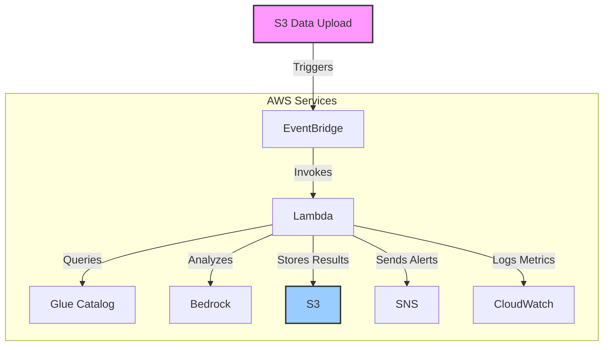

# AWS Data Quality Bots with Amazon Bedrock

A production-ready, AI-powered solution for autonomous data quality monitoring, analysis, and remediation in AWS data lakes. This solution leverages Amazon Bedrock's foundation models to provide intelligent insights and recommendations for data quality issues.

## 🚀 Features

- **AI-Powered Analysis**: Utilizes Amazon Bedrock's foundation models for intelligent data quality analysis
- **Automated Data Quality Checks**: Implements comprehensive validation rules for data quality
- **Flexible Data Sources**: Works with various data formats in S3
- **Detailed Reporting**: Generates comprehensive data quality reports
- **Serverless Architecture**: Built on AWS Lambda, Glue, and EventBridge
- **Easy Deployment**: Simple setup with Terraform or manual AWS console configuration
- **Extensible Design**: Easy to add custom validation rules and data sources

## 🏗️ Architecture



## 🚀 Quick Start

### Prerequisites

- AWS Account with appropriate permissions
- Python 3.8+ and pip
- AWS CLI configured with credentials
- Terraform (for automated deployment)

### Automated Deployment with Terraform

1. Clone the repository:
   ```bash
   git clone https://github.com/your-org/aws-data-quality-bots.git
   cd aws-data-quality-bots
   ```

2. Initialize Terraform:
   ```bash
   terraform init
   ```

3. Review and customize variables in `terraform.tfvars`

4. Deploy the infrastructure:
   ```bash
   terraform apply
   ```

### Manual Deployment

For manual deployment steps, see [MANUAL_DEPLOYMENT.md](MANUAL_DEPLOYMENT.md)

## 🛠 Prerequisites

- AWS Account with appropriate permissions
- Terraform v1.3.0 or later
- AWS CLI v2.x configured with credentials
- Python 3.9+ (for local development and testing)
- Node.js 16+ (for running development tools)
- [pre-commit](https://pre-commit.com/) (for Git hooks)

## 🚀 Quick Start

1. **Clone the repository**
   ```bash
   git clone https://github.com/your-org/aws-data-quality-bots.git
   cd aws-data-quality-bots
   ```

2. **Install development dependencies**
   ```bash
   make init
   ```

3. **Configure your environment**
   ```bash
   cp terraform.tfvars.example terraform.tfvars
   # Edit terraform.tfvars with your configuration
   ```

4. **Initialize and apply Terraform**
   ```bash
   make plan  # Review the changes
   make apply  # Apply the configuration
   ```

## 🏗 Project Structure

```
aws-data-quality-bots/
├── .github/                  # GitHub Actions workflows
│   └── workflows/
│       └── deploy.yml        # CI/CD pipeline
├── lambda_functions/         # Lambda function code
│   └── data_quality_checker/
│       ├── lambda_function.py  # Main Lambda handler
│       ├── requirements.txt    # Python dependencies
│       └── tests/             # Unit tests
├── modules/                  # Reusable Terraform modules
├── .pre-commit-config.yaml   # Pre-commit hooks
├── Makefile                 # Development commands
├── main.tf                  # Main Terraform configuration
├── variables.tf             # Input variables
├── outputs.tf               # Output values
├── providers.tf             # Provider configurations
├── versions.tf              # Version constraints
└── README.md                # This file
```

## 🔧 Configuration

### Environment Variables

| Variable | Description | Default | Required |
|----------|-------------|---------|:--------:|
| `S3_BUCKET` | S3 bucket for storing results | - | ✅ |
| `SNS_TOPIC_ARN` | SNS topic ARN for alerts | - | ❌ |
| `DEFAULT_DATABASE` | Default Glue database to check | "default" | ❌ |
| `BEDROCK_REGION` | AWS region for Bedrock service | Same as Lambda | ❌ |
| `LOG_LEVEL` | Logging level (DEBUG, INFO, WARNING, ERROR) | "INFO" | ❌ |
| `MAX_RETRY_ATTEMPTS` | Maximum retry attempts for Bedrock API | 3 | ❌ |
| `BEDROCK_MODEL_ID` | Bedrock model ID to use | "anthropic.claude-3-sonnet-20240229-v1:0" | ❌ |
| `ENABLE_AI_ANALYSIS` | Enable/disable AI analysis | true | ❌ |

### Terraform Variables

Key variables to configure in `terraform.tfvars`:

```hcl
# AWS Configuration
aws_region = "us-east-1"

# Project Configuration
project_name = "data-quality-bots"
environment  = "dev"

# Data Quality Configuration
default_database  = "your_database"
default_table     = "your_table"  # Leave empty to check all tables
enable_ai_analysis = true
log_level         = "INFO"
log_retention_days = 30

# Notification Configuration
notification_emails = ["your-email@example.com"]

# VPC Configuration (if needed)
# vpc_id = "vpc-xxxxxxxx"
# lambda_subnet_ids = ["subnet-xxxxxxxx", "subnet-yyyyyyyy"]
```

## 🚦 Usage

### Running Manually

Invoke the Lambda function with custom parameters:

```bash
aws lambda invoke \
  --function-name data-quality-bots-dev-checker \
  --payload '{
    "database": "your_database", 
    "table": "your_table",
    "enable_ai_analysis": true
  }' \
  output.json
```

### Viewing Results

1. **S3 Reports**:
   ```bash
   # List all quality reports
   aws s3 ls s3://data-quality-bots-dev-123456789012/quality-reports/
   
   # Download a specific report
   aws s3 cp s3://data-quality-bots-dev-123456789012/quality-reports/your_database/your_table/2023/01/01/20230101_120000.md .
   ```

2. **CloudWatch Logs**:
   ```bash
   # View recent logs
   aws logs tail /aws/lambda/data-quality-bots-dev-checker --follow
   
   # Open in CloudWatch Console
   aws console logs tail --follow /aws/lambda/data-quality-bots-dev-checker
   ```

3. **CloudWatch Dashboard**:
   Access the pre-configured dashboard through the AWS Console or via the URL output by Terraform.

## 🤖 AI-Powered Analysis

The solution uses Amazon Bedrock to provide intelligent analysis of your data quality. The following agents work together:

1. **Data Profiler**: Analyzes data structure and statistics
2. **Rule Engine**: Applies custom data quality rules
3. **Anomaly Detector**: Identifies unusual patterns
4. **Root Cause Analyzer**: Determines potential causes of issues
5. **Remediation Advisor**: Suggests fixes for identified problems

### Customizing AI Behavior

You can customize the behavior of the AI agents by modifying the system prompts in the `BedrockAgent` class in `lambda_function.py`.

## 🔄 CI/CD Pipeline

The included GitHub Actions workflow automates testing and deployment:

1. **On PR**:
   - Terraform format check
   - Terraform validation
   - Python linting and type checking
   - Unit tests

2. **On merge to main**:
   - Terraform plan
   - Approval required
   - Terraform apply

## 🧪 Testing

Run the test suite:

```bash
make test
```

Run specific tests:

```bash
pytest lambda_functions/data_quality_checker/tests/test_data_quality.py -v
```

## 🧹 Cleanup

To remove all resources created by Terraform:

```bash
make destroy
```

## 📄 License

This project is licensed under the MIT License - see the [LICENSE](LICENSE) file for details.

## 🤝 Contributing

Contributions are welcome! Please read our [Contributing Guidelines](CONTRIBUTING.md) for details on our code of conduct and the process for submitting pull requests.

## 📝 TODO

- [ ] Add more data quality checks
- [ ] Support for additional data sources
- [ ] Enhanced visualization dashboard
- [ ] Automated remediation workflows
